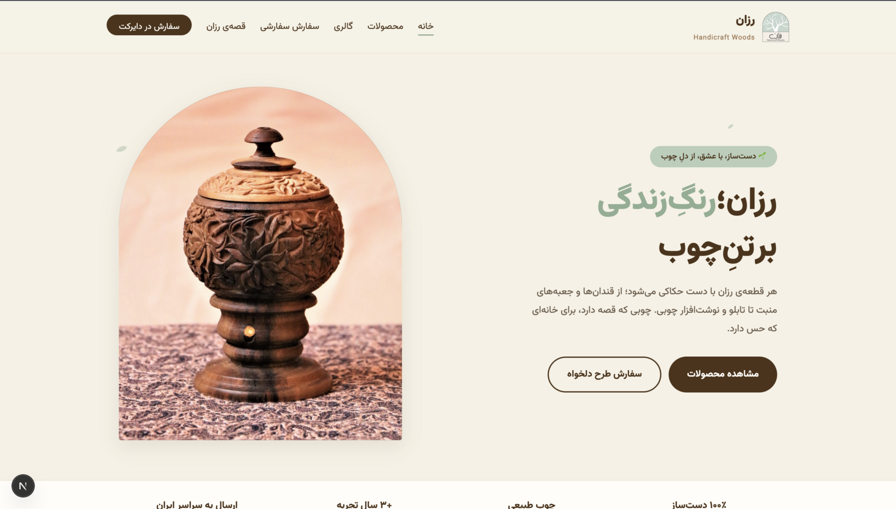
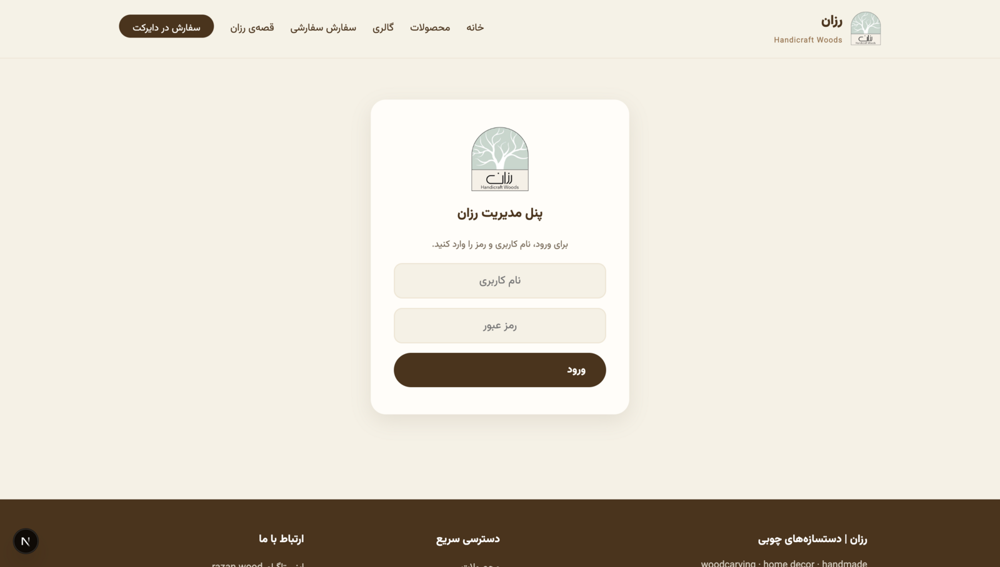

# Razan — Handcrafted Woodwork E-Commerce

A full-stack, RTL (Persian) e-commerce showcase for **Razan Handicraft Woods**, a hand-carved woodwork brand. Built end-to-end: custom design system, cinematic product showcase, live search with autocomplete, and a self-hosted admin panel — products go live **instantly, with zero rebuilds**.

**🌿 [View Live Demo →](https://razan-wood-1.onrender.com)**

> 🇮🇷 مستندات فارسی: [README.fa.md](./README.fa.md)



<details>
<summary>More screenshots</summary>

### Admin login


</details>

## ✨ Highlights

- **Custom design system** derived from the brand's visual identity (sage / cream / walnut palette, arch motifs from the logo), with signature motion: Ken Burns product spotlight, scroll-reveals, multi-photo hover cards, animated counters — all respecting `prefers-reduced-motion`
- **Live search with autocomplete** — suggests products (with thumbnails) and categories as you type; full keyboard navigation (↑ ↓ Enter Esc) and match highlighting
- **Admin panel at `/admin`** — username/password auth (httpOnly cookie + middleware), multi-image upload with automatic resize/compression (sharp), instant publish to the live site
- **Zero-native-dependency SQLite** via Node's built-in `node:sqlite` — no compilation step, deploys anywhere Node 22+ runs
- **Conversion flow built for DM commerce** — every product deep-links into Instagram Direct / WhatsApp with a pre-filled message; a custom-order form composes the message from user input
- **SEO-ready** — per-product server-rendered pages with dedicated metadata/OG tags, dynamic `sitemap.xml` and `robots.txt`, self-hosted variable font (no Google Fonts dependency)

## 🛠 Tech Stack

| Layer | Choice |
|---|---|
| Framework | Next.js 15 (App Router), React 19 |
| Database | SQLite via built-in `node:sqlite` (Node 22+) |
| Images | sharp (resize + compress on upload), served from a persistent volume |
| Auth | Env-based credentials, SHA-256 token, httpOnly cookie, edge middleware |
| Styling | Hand-written CSS design system (no UI framework), RTL-first |
| Deploy | `output: standalone` — any Node host (tested for Liara PaaS) |

## 🚀 Getting Started

```bash
npm install
cp .env.example .env   # set ADMIN_USER / ADMIN_PASSWORD
npm run dev            # http://localhost:3000 — admin at /admin
```

## 📦 Deployment (Liara / any Node host)

1. Create a Next.js app, mount a persistent disk at `/app/data`
2. Set env vars: `ADMIN_USER`, `ADMIN_PASSWORD`, `DATA_DIR=/app/data`
3. `liara deploy` (or `npm run build && npm start` on any Node 22+ host)

The database seeds itself from `lib/data/products.json` on first run.

## 🗂 Structure

```
app/            pages (App Router) + API route handlers
  admin/        admin panel (login + dashboard)
  api/admin/    protected CRUD endpoints
  media/        runtime-uploaded image serving
components/     UI components (Spotlight, ProductsExplorer, ProductCard, …)
lib/            db, auth, image pipeline, site config, seed data
middleware.js   auth guard for /admin and /api/admin
```

---

Designed & built by [Amirali](https://github.com/amirali-nam) · Handcrafted products by [razan.wood](https://www.instagram.com/razan.wood)
